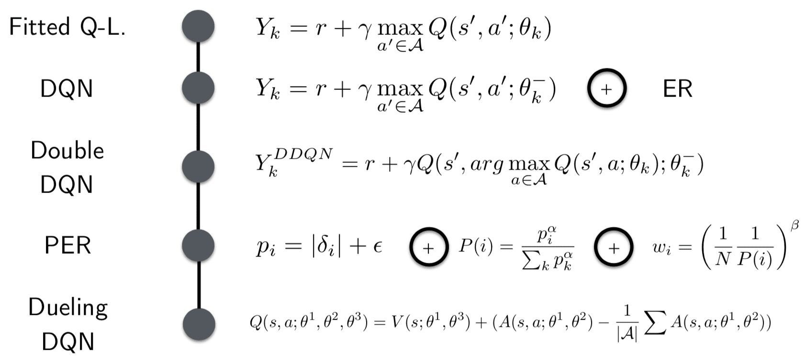

# A Tutorial Series on Deep Reinforcement Learning
## Author: Robert Tjarko Lange (ECN Berlin)

This repository contains a series of tutorials on Deep Reinforcement Learning (DRL). This includes slides as well as experiments. Going forward I plan on adding exercises as well as complementary blog posts. So stay tuned!

### Deep Q-Learning (July 2019)




* [Slides](Deep_Q_Learning.pdf): Includes DQN, Double DQN, Prioritized Experience Replay & Dueling DQNs
* [Experiments](EXPERIMENTS_DQL): Provides code to implement all of the above.
* Replicating the experiments:
    1. Create & activate a virtual env. Install the requirements.
    2. Afterwards you can run all experiments by executing:

        ```
        bash run_experiments_dqn_double.sh
        bash run_experiments_per_dueling.sh
        ```
    3. The visualizations for the different experiments as well as the mini double DQN illustration can be replicated by executing the notebook:

        ```
        jupyter notebook viz_results.ipynb
        ```

    4. Finally, in order to visualize an episode rollout of a DQN agent at different stages do the following:

        ```
        python train_dqn.py --SAVE_AGENT
        python enjoy_dense.py --AGENT 5000_MLP-DQN --TITLE 5000
        python enjoy_dense.py --AGENT 40000_MLP-DQN --TITLE 40000
        python enjoy_dense.py --AGENT 500000_MLP-DQN --TITLE 500000
        ```

### Deep Policy Gradients (to be continued)
